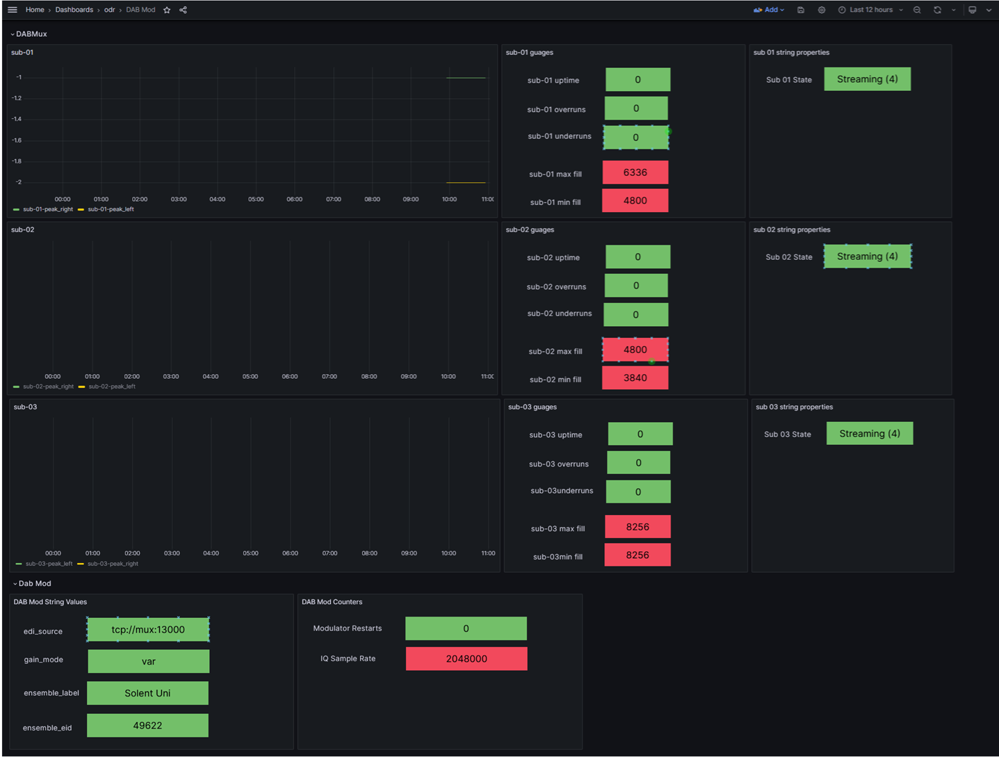

# ODR DAB monitoring

[Main Menu](../README.md) | [Kuwaiba Broadcast Radio Demonstration](./README.md) | [ADDITIONAL NOTES](./ADDITIONAL_NOTES.md)

Sine the last version, new devices have been added to the simulation.
The MIBs and configurations are in the [radio-mibs](./radio-mibs) folder.

# Tredess

See [Tredess Config](./radio-mibs/Tredess/TREDESS-FS-MIB/customised/)

polling:

A minimal snmpsim configuration has been created pending an SNMP walk of a real device.

events - alarms:

The trap configuration just generates events and not alarms.
More information and examples are needed to map the events to alarms.
However, the ireasoning mibbrowser can be used to send traps to the device.


## Pro-Television PT3070

See [Pro-Television PT3070 Config](./radio-mibs/Pro-Television/customised/)

polling:

A snmpsim configuration has been created to give a few statistics pending an SNMP walk of a real device.

(A dashboard to see this device still needs created).

events - alarms:

The trap configuration has been created to generate alarms and events based on a superficial reading of the PT3070 mib

A large number of example traps are provided to test generating and clearing alarms.
These can be tested using netsnmp commands given in [Pro-Television PT3070 Config](./radio-mibs/Pro-Television/customised/README.md). 

Tos send traps from the PT3070, use docker compose to log into the container and use the command, remembering to change the `horizon` address to the minion address you are able to see on the network (e.g. examples below `minion2` which represents crabwood farm.

```

 docker compose --profile opennms exec PT3070 bash
 
 # pt3070NotifModulatorAlarm   Modulator Alarms Raise 
 
 root@PT3070:/#  snmptrap -v 2c -c public minion2:1162    ""   .1.3.6.1.4.1.18086.3070.64.0.3  .1.3.6.1.4.1.18086.3070.64.1.0  s "Modulator Alarms"  .1.3.6.1.4.1.18086.3070.64.2  i   1  .1.3.6.1.4.1.18086.3070.64.3 s ""
 
 # pt3070NotifModulatorAlarm   Modulator Alarms Clear
 
 root@PT3070:/#  snmptrap -v 2c -c public minion2:1162    ""   .1.3.6.1.4.1.18086.3070.64.0.3  .1.3.6.1.4.1.18086.3070.64.1.0  s "Modulator Alarms"  .1.3.6.1.4.1.18086.3070.64.2  i   0  .1.3.6.1.4.1.18086.3070.64.3 s ""

```

or use direct command

```
 # pt3070NotifModulatorAlarm   Modulator Alarms Raise
 
docker compose --profile opennms exec PT3070  snmptrap -v 2c -c public minion2:1162    ""   .1.3.6.1.4.1.18086.3070.64.0.3  .1.3.6.1.4.1.18086.3070.64.1.0  s "Modulator Alarms"  .1.3.6.1.4.1.18086.3070.64.2  i   1  .1.3.6.1.4.1.18086.3070.64.3 s ""
```

```
 # pt3070NotifModulatorAlarm   Modulator Alarms Clear
 
docker compose --profile opennms exec PT3070  snmptrap -v 2c -c public minion2:1162    ""   .1.3.6.1.4.1.18086.3070.64.0.3  .1.3.6.1.4.1.18086.3070.64.1.0  s "Modulator Alarms"  .1.3.6.1.4.1.18086.3070.64.2  i   0  .1.3.6.1.4.1.18086.3070.64.3 s ""
```

## ODR Mux and Modulator

The ODR Mux and modulator use json to show the status of the device.
This has been simulated in this demo in the container DABmux using nginx to serve up static json files representing the real data.

You can see the json on a browser using 

http://localhost:8082/stats/mux

http://localhost:8082/stats/mod

The OpenNMS configuration to read these files is in the files

/container-fs/horizon/opt/opennms-overlay/etc/xml-datacollection/stats_odr_dab_mod.xml

/container-fs/horizon/opt/opennms-overlay/etc/xml-datacollection/stats_odr_dab_mux.xml

The configuration can be loaded 

/container-fs/horizon/opt/opennms-overlay/etc/imports/dab-test.xml

A grafana dashboard to see the ODR mux is defined in 

container-fs/grafana/provisioning/dashboards/odr/dashboard-odr-mod.json

You can browse this at https://localhost/grafana/dashboards

See screen shot below 




